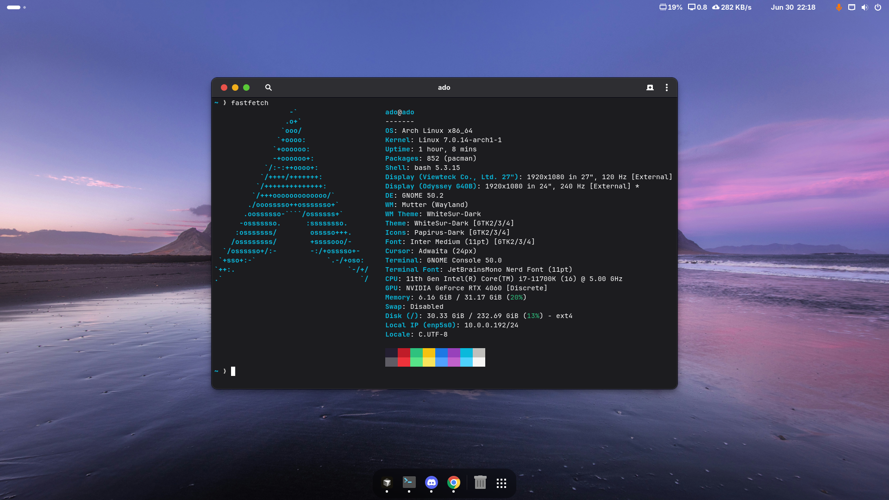

<p align="center">
  
</p>

<h3 align="center">arch-dotfiles</h3>

<p align="center">
  My personal Arch Linux + GNOME dotfiles, managed with
  <a href="https://www.chezmoi.io/">chezmoi</a>.
</p>



<table>
<tr>
<td valign="top" width="50%">

### GNOME extensions

- [Dash to Dock](https://extensions.gnome.org/extension/307/dash-to-dock/) — macOS-style dock
- [Blur my Shell](https://extensions.gnome.org/extension/3193/blur-my-shell/) — blurred panel, overview & dock
- [Open Bar](https://extensions.gnome.org/extension/6580/open-bar/) — top-bar theming
- [Just Perfection](https://extensions.gnome.org/extension/3843/just-perfection/) — fine-grained shell tweaks
- [Vitals](https://extensions.gnome.org/extension/1460/vitals/) — CPU / temp / RAM in the bar
- [Hide Top Bar](https://extensions.gnome.org/extension/545/hide-top-bar/) — auto-hide the top bar
- [Tray Icons: Reloaded](https://extensions.gnome.org/extension/2890/tray-icons-reloaded/) — legacy tray icons
- [Move Clock](https://extensions.gnome.org/extension/2/move-clock/) — clock to the left

Full enable list in [`gnome/extensions.txt`](gnome/extensions.txt).

</td>
<td valign="top" width="50%">

### CLI tools

- [eza](https://github.com/eza-community/eza) — modern `ls`
- [bat](https://github.com/sharkdp/bat) — `cat` with syntax highlighting
- [fd](https://github.com/sharkdp/fd) — friendly `find`
- [fzf](https://github.com/junegunn/fzf) — fuzzy finder
- [zoxide](https://github.com/ajeetdsouza/zoxide) — smarter `cd`
- [starship](https://starship.rs) — shell prompt
- [mise](https://mise.jdx.dev) — runtime / version manager
- [yay](https://github.com/Jguer/yay) — AUR helper

</td>
</tr>
</table>

### What's in here

```
dot_bashrc              → ~/.bashrc          starship/mise/zoxide/fzf + aliases
dot_gitconfig           → ~/.gitconfig
private_dot_config/     → ~/.config/         starship, mise, gh, git, gtk-3/4, fontconfig
gnome/dconf.ini         full GNOME settings dump (theme, keybinds, dock, extensions)
gnome/extensions.txt    enabled shell extensions
system/keyd/            → /etc/keyd/         Caps Lock → WASD arrow layer
pkglist.txt             explicitly-installed pacman packages
```

`README.md`, `pkglist.txt`, `gnome/`, `system/`, and `screenshots/` stay in the
repo but are excluded from `$HOME` via [`.chezmoiignore`](.chezmoiignore).

### Install

```bash
sudo pacman -S --needed - < pkglist.txt              # packages
chezmoi init --apply https://github.com/ado11231/arch-dotfiles.git
mise install
```

Then restore the rest.

**GNOME desktop** — theme, keybinds, dock & extension settings:

```bash
dconf load / < gnome/dconf.ini
# then enable the extensions from gnome/extensions.txt and log out/in
```

**GTK theme** (WhiteSur):

```bash
yay -S whitesur-gtk-theme
gsettings set org.gnome.desktop.interface gtk-theme 'WhiteSur-Dark'
```

**keyd** — Caps Lock → WASD arrow layer:

```bash
sudo cp system/keyd/default.conf /etc/keyd/default.conf
sudo systemctl enable --now keyd
```
